# **Emotion semantic space: Individual difference & Prediction of well-being**

Di Liu

Bi Lab

Guided by: Prof. Yanchao Bi and Dr. Xiaosha Wang

\-----------------------------------------------------------------------------------------

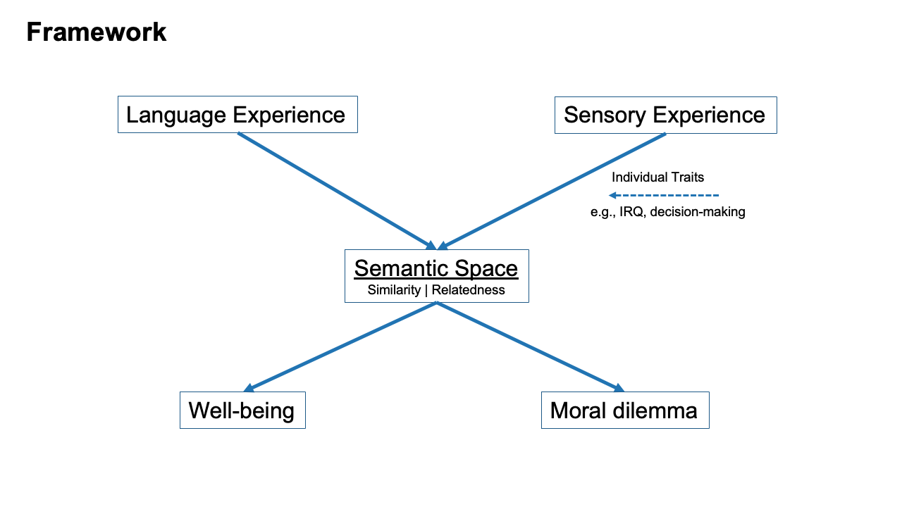

\---

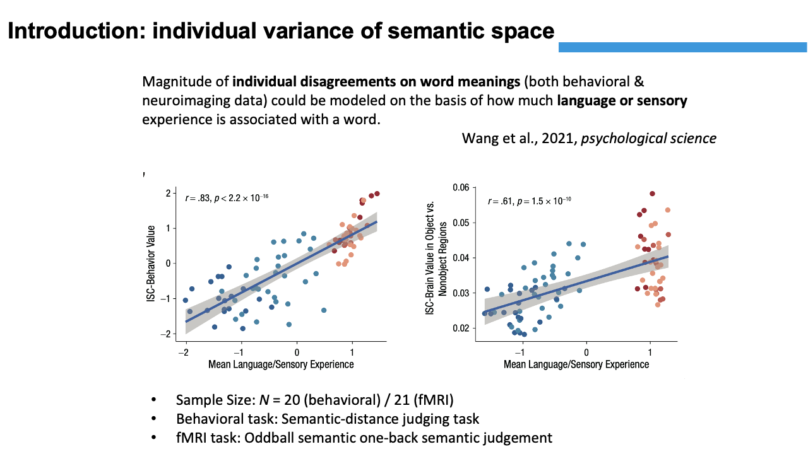

\---

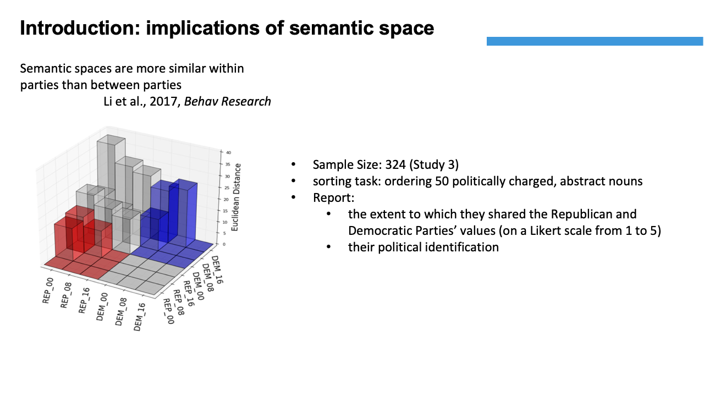

\---

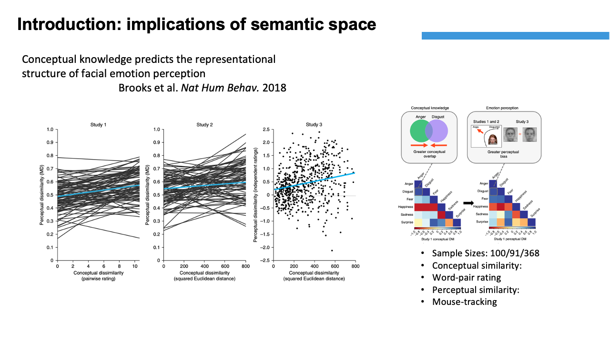

\---

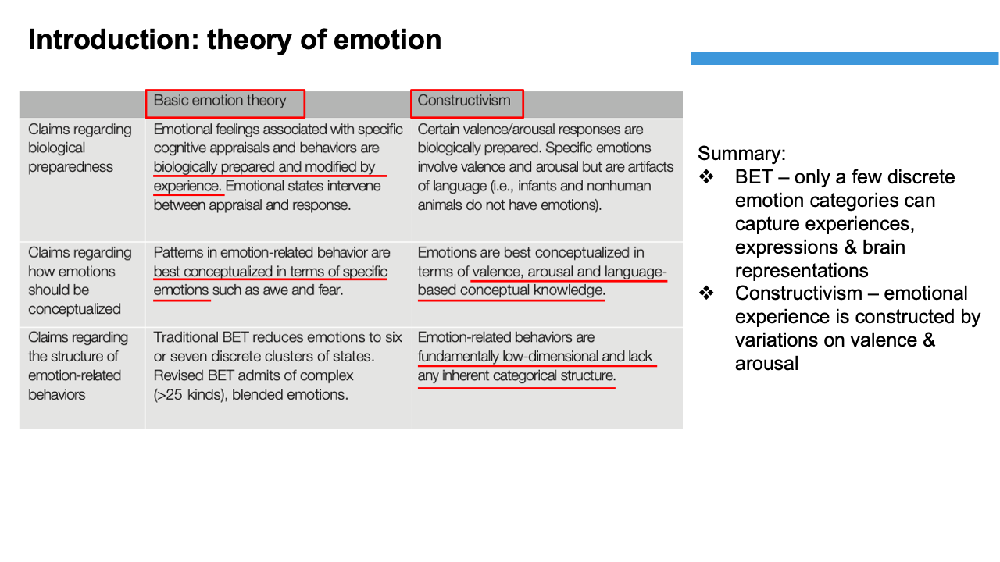

\---

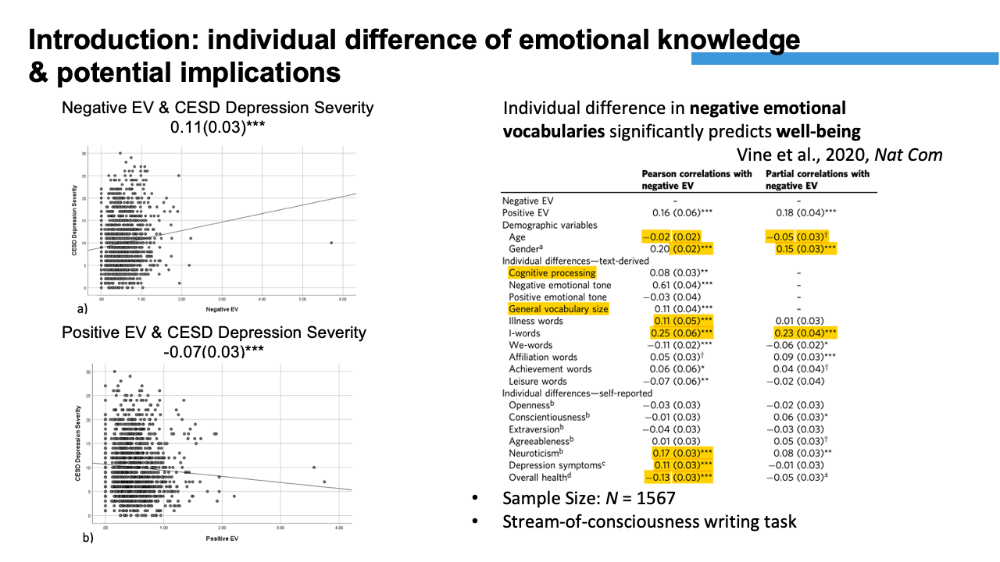

\---

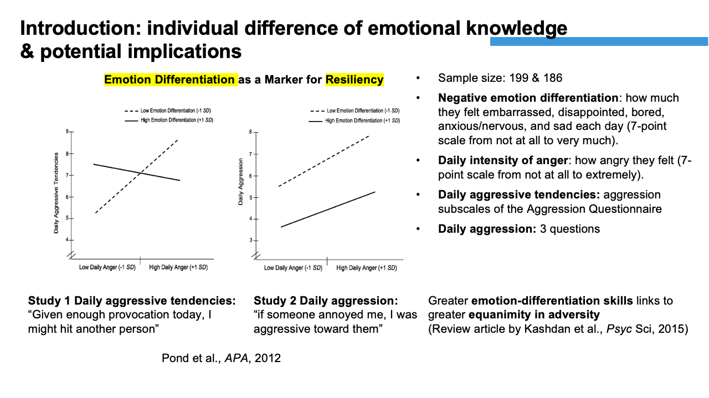

\---

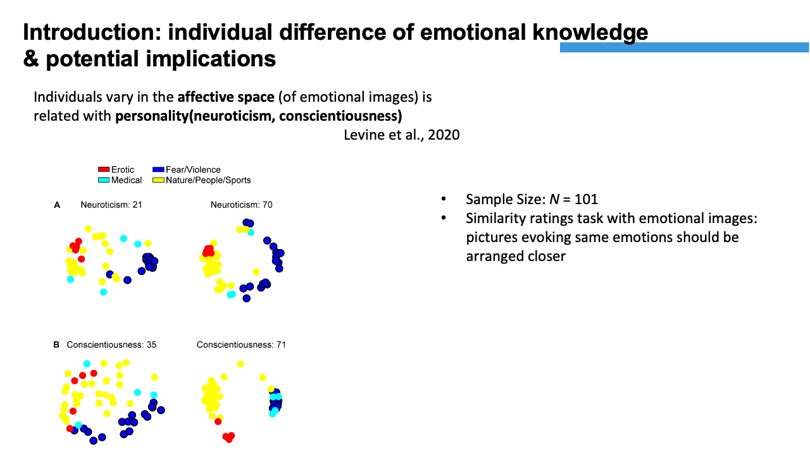

\---

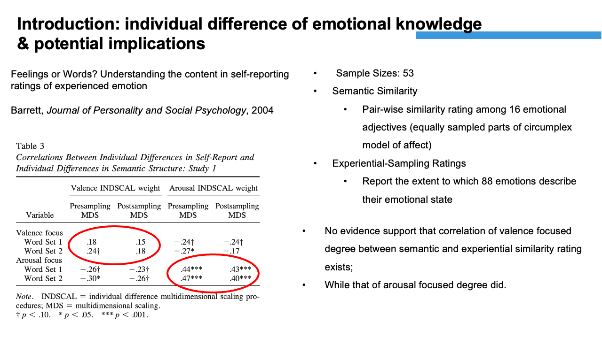

\---

\---

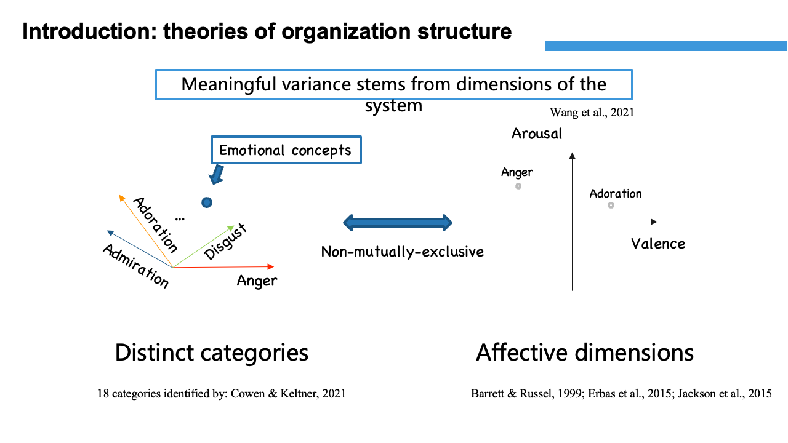

\---

\---

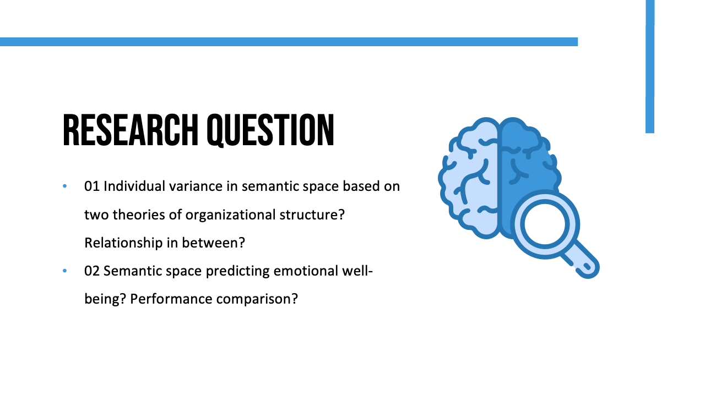